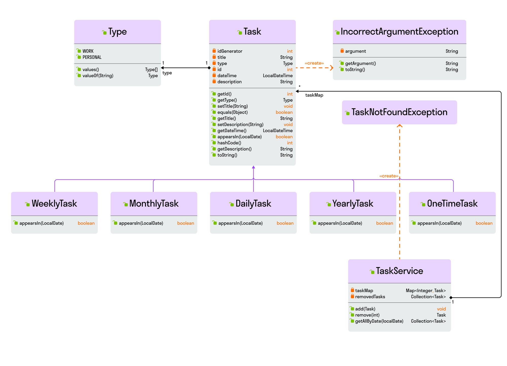
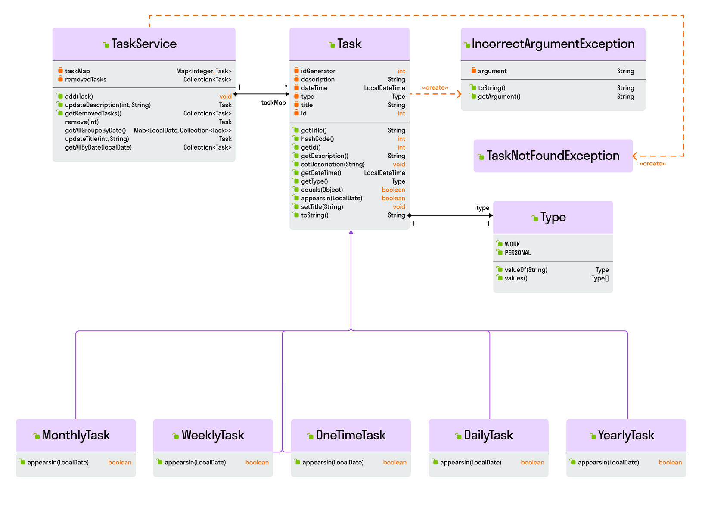

<!DOCTYPE html>
<html class="notion-html"><head lang="en">
<meta http-equiv="content-type" content="text/html; charset=UTF-8"><meta charset="utf-8"><meta name="viewport" content="width=device-width,height=device-height,initial-scale=1,maximum-scale=1,user-scalable=no,viewport-fit=cover"><title>Курсовая работа 2-го курса</title><meta name="description" content="A new tool that blends your everyday work apps into one. It's the all-in-one workspace for you and your team"><meta name="twitter:card" content="summary_large_image"><meta name="twitter:site" content="@NotionHQ"><meta name="twitter:title" content="Notion – The all-in-one workspace for your notes, tasks, wikis, and databases."><meta name="twitter:description" content="A new tool that blends your everyday work apps into one. It's the all-in-one workspace for you and your team"><meta name="twitter:url" content="https://www.notion.so"><meta name="twitter:image" content="https://www.notion.so/images/meta/default.png"><meta property="og:site_name" content="Notion"><meta property="og:type" content="website"><meta property="og:url" content="https://www.notion.so"><meta property="og:title" content="Notion – The all-in-one workspace for your notes, tasks, wikis, and databases."><meta property="og:description" content="A new tool that blends your everyday work apps into one. It's the all-in-one workspace for you and your team"><meta property="og:image" content="https://www.notion.so/images/meta/default.png"><meta property="og:locale" content="en_US"><link rel="shortcut icon" type="image/x-icon" href="data:image/png;base64,iVBORw0KGgoAAAANSUhEUgAAACAAAAAgCAYAAABzenr0AAAChUlEQVRYR2NkgIL///8zxubV6V3+K5P59fd/bwZGBhmYHLXo//8Y3vCwMa41EuRrnd8a+RhkLiOI+L9qFbPz6Z9pD99/bWJkYhABiQnycDBwsjAwMLGyMTCxsFHshn9/fjG8eP+V4c+fvwycjH+emIgIW4EcAXaAQ+mihKcfv03/z8DAISvIzhBnq8KgJC7IwMLCAsTMDCzMzBQ7AGTAnZefGObsucxw//VXBkHmn8tOTcuLYfSMzuV7xqdx9utfZhWQopZoWwZ9OUGqWIhsyLfvP8Dch2+/MTSvPsHw6dufN5ZijHqM2VO2yu+89PgBTHFbgjODuZIw1R3A8P//3zfvP4KDsnntaYYrj98zuOvJKmA4gJ+Hi0FHhp+BS0gCGPfsVHGImSwng7WSIMPvP38YQCExadMJhqP3PmF3AMxGYSkZBhYOfqo4AGSIuTQbQ4K5JNgRRDlA2ciWgVtAiGIHvH/1kuHXt89gc9LMBBl0JLiIc4CKiQMDn5AYxQ4AGfD62SOwI5wV2Rn8dUXo74AfP34wvH1yl8FRgZ0hUG8AHPDnz0+Glw/ujDpgNARGQ2A0BEZDYDQERkMAJQQuPHx/x5j3oRFGmxDWAqFmgwS9Op66+eSP608/RB2flLl+QBzw9OXbDD9H05kgzw6IA3i4WL3UFWS3D4gDwoxErvCyMtoqKip+ADsgpmqm5PFX/y/B+oS0SANfPn9j+PjyPoO9HNulaBPBeG01tQswexhBvWK9zDlt3//9rUBuAlMrEf7795fhzdP7DP9//36g+v+F7Zzy4CfI9oA7p5ahhZxfhLXqvv35mwILCWo4ANQa/vruFcO/bx+OSHCzpS7PtbqB3s4HANDVPZyVyAz5AAAAAElFTkSuQmCC"><link rel="apple-touch-icon" href="https://skyengpublic.notion.site/images/logo-ios.png"><meta name="apple-mobile-web-app-capable" content="yes"><meta name="apple-itunes-app" content="app-id=1232780281"><meta name="format-detection" content="telephone=no"><meta name="msapplication-tap-highlight" content="no"><meta name="slack-app-id" content="A049JV0H0KC"><link href="redme1.md_files/print.b31f28aa.css" rel="stylesheet" media="print"><link href="redme1.md_files/app-6b6a1c97dc3362bbd58b.css" rel="stylesheet"></head><body class="notion-body">

Курсовая работа 2-го курса

<svg viewBox="0 0 17 17" style="width: 14px; height: 14px; display: block; fill: inherit; flex-shrink: 0; backface-visibility: hidden; margin-right: 6px;" class="searchNew"><path d="M6.78027 13.6729C8.24805 13.6729 9.60156 13.1982 10.709 12.4072L14.875 16.5732C15.0684 16.7666 15.3232 16.8633 15.5957 16.8633C16.167 16.8633 16.5713 16.4238 16.5713 15.8613C16.5713 15.5977 16.4834 15.3516 16.29 15.1582L12.1504 11.0098C13.0205 9.86719 13.5391 8.45215 13.5391 6.91406C13.5391 3.19629 10.498 0.155273 6.78027 0.155273C3.0625 0.155273 0.0214844 3.19629 0.0214844 6.91406C0.0214844 10.6318 3.0625 13.6729 6.78027 13.6729ZM6.78027 12.2139C3.87988 12.2139 1.48047 9.81445 1.48047 6.91406C1.48047 4.01367 3.87988 1.61426 6.78027 1.61426C9.68066 1.61426 12.0801 4.01367 12.0801 6.91406C12.0801 9.81445 9.68066 12.2139 6.78027 12.2139Z"></path></svg>Search

Duplicate

<svg viewBox="0 0 13 3" style="width: 18px; height: 18px; display: block; fill: inherit; flex-shrink: 0; backface-visibility: hidden;" class="dots"><g><path d="M3,1.5A1.5,1.5,0,1,1,1.5,0,1.5,1.5,0,0,1,3,1.5Z"></path><path d="M8,1.5A1.5,1.5,0,1,1,6.5,0,1.5,1.5,0,0,1,8,1.5Z"></path><path d="M13,1.5A1.5,1.5,0,1,1,11.5,0,1.5,1.5,0,0,1,13,1.5Z"></path></g></svg>

<svg viewBox="0 0 120 126" style="width: 18px; height: 18px; display: block; fill: inherit; flex-shrink: 0; backface-visibility: hidden; margin-right: 6px;" class="notionLogo"><path d="M 20.6927 21.9315C 24.5836 25.0924 26.0432 24.8512 33.3492 24.3638L 102.228 20.2279C 103.689 20.2279 102.474 18.7705 101.987 18.5283L 90.5477 10.2586C 88.3558 8.55699 85.4356 6.60818 79.8387 7.09563L 13.1433 11.9602C 10.711 12.2014 10.2251 13.4175 11.1939 14.3924L 20.6927 21.9315ZM 24.8281 37.9835L 24.8281 110.456C 24.8281 114.351 26.7745 115.808 31.1553 115.567L 106.853 111.187C 111.236 110.946 111.724 108.267 111.724 105.103L 111.724 33.1169C 111.724 29.958 110.509 28.2544 107.826 28.4976L 28.721 33.1169C 25.8018 33.3622 24.8281 34.8225 24.8281 37.9835ZM 99.5567 41.8711C 100.042 44.0622 99.5567 46.2512 97.3618 46.4974L 93.7143 47.2241L 93.7143 100.728C 90.5477 102.43 87.6275 103.403 85.1942 103.403C 81.2983 103.403 80.3226 102.186 77.4044 98.54L 53.5471 61.087L 53.5471 97.3239L 61.0964 99.0275C 61.0964 99.0275 61.0964 103.403 55.0057 103.403L 38.2148 104.377C 37.727 103.403 38.2148 100.973 39.9179 100.486L 44.2996 99.2717L 44.2996 51.36L 38.2158 50.8725C 37.728 48.6815 38.9431 45.5225 42.3532 45.2773L 60.3661 44.0631L 85.1942 82.0036L 85.1942 48.4402L 78.864 47.7136C 78.3781 45.0351 80.3226 43.0902 82.7569 42.849L 99.5567 41.8711ZM 7.5434 5.39404L 76.9175 0.285276C 85.4366 -0.445402 87.6285 0.0440428 92.983 3.93368L 115.128 19.4982C 118.782 22.1747 120 22.9034 120 25.8211L 120 111.187C 120 116.537 118.051 119.701 111.237 120.185L 30.6734 125.05C 25.5584 125.294 23.124 124.565 20.4453 121.158L 4.13735 99.9994C 1.21516 96.1048 0 93.191 0 89.7819L 0 13.903C 0 9.5279 1.94945 5.8785 7.5434 5.39404Z"></path></svg>Try Notion

Курсовая работа 2-го курса

<main style="display: flex; width: 100%; justify-content: center; padding-top: 5px;">

Курсовая работа 2 курса состоит из 2х блоков — курсового проекта и задачи на функциональное программирование. Оба задания составлены на основе отборочных заданий в реальные IT-компании.

Курсовой проект

Данное задание разделено на две части. Часть 1 обязательная и мы примем вашу
кандидатуру к рассмотрению только в том случае, если часть 1 выполнена. Часть 2
опциональная, по количеству задач из этой части которые вы смогли выполнить, мы
сможем оценить ваш уровень опыта и навыков в области java-разработки.

Вам нужно отправить ответ на задание в виде ссылки на github репозиторий. Только в таком случае у нас будет возможность проверить ваше тестовое задание.

Часть 1

Напишите сервис по управлению задачами по типу ежедневника.

В ежедневник можно заносить задачи, можно удалять их, можно получать список задач на предстоящий день. 

Каждая задача обязательно имеет заголовок. У каждой задачи может быть поле для описания. Также все задачи обязательно нужно делить по типу: личные или рабочие задачи. У каждой задачи есть дата и время, которые были присвоены при создании. 

Также для более гибкого управления задачами рекомендуется завести поле id, которое нужно проставлять через генератор.

Кроме того, в ежедневнике задачи должны иметь разную повторяемость, которую можно указать при создании задачи: 

однократная, 

ежедневная, 

еженедельная, 

ежемесячная, 

ежегодная.

У каждой повторяемости есть метод для получения следующей даты и времени выполнения. 

Заголовок, описание, тип и признак повторяемости обязательны к заполнению. 

Все задачи должны храниться в коллекции, тип которой нужно выбрать самостоятельно как самый оптимальный для работы. 

Организацию работы с задачами необходимо сделать в виде отдельного класса-сервиса, который будет хранить коллекцию задач и методы по работе с этими задачами. 

Управление задачами осуществляется через консоль и класс Scanner. 

 

Условия:

Ввод данных осуществляется через консоль, используя класс Scanner или задается  явно в коде через переменные.

Каждой задаче присвоен id.

Можно выбрать тип задачи: личная или рабочая. 

Реализована функция повторяемости задачи: 

однократная, 

ежедневная, 

еженедельная, 

ежемесячная, 

ежегодная. 

Обработаны ошибки при вводе некорректных данных.

В сервисе добавлены методы: 

«Добавить задачу»,

«Получить задачи на день». 

«Удалить задачу по id».

 Структура приложения для Задачи 1

В результате должно получиться  приложение, в которое можно заносить новые задачи через консоль или через переменные, удалять задачи, получать список всех задач на день с помощью методов.  
Обратите внимание, что все операции с задачами должны осуществляться через меню. 

Часть 2

Доработайте алгоритм удаления задач: если раньше задачи просто удалялись, то теперь их нужно переводить в архив удаленных задач и с помощью метода получать список всех удаленных задач.  

Доработайте само приложение: теперь после создания задачи ее поля (заголовок и описание) можно редактировать. 

Также в доработанном приложении добавьте возможность (= метод) получать задачи, сгруппированные по датам. 

Структура приложения для Задачи 2

В результате должно получиться приложение, в которое можно заносить задачи, удалять задачи, редактировать задачи, получать список всех задач на день. Удаленные задачи перемещаются в отдельный список (как архив), откуда их можно посмотреть. 

Задача на функциональное программирование

Напишите приложение, которое на вход через консоль, получит текст и выдаст статистику:

Количество слов в тексте

TOP10 самых часто упоминаемых слов, упорядоченных по количеству упоминаний в
обратном порядке. В случае одинакового количества упоминаний слова должны быть отсортированы по алфавиту.

Например:

Input:
yourapp the quick brown fox jumps over the lazy dog

Output:
В тексте 9 слов
TOP10:
2 — the
1 — brown
1 — dog
1 — fox
1 — jumps
1 — lazy
1 — over
1 — quick

Гарантируется передача какой-либо строки на вход.

</main>

<textarea style="opacity: 0; pointer-events: none; position: fixed; left: 0px; top: 0px;">-</textarea><textarea style="opacity: 0; pointer-events: none; position: fixed; left: 0px; top: 0px;"></textarea>

<iframe sandbox="allow-scripts allow-same-origin" style="position: absolute; opacity: 0; width: 1px; height: 1px; top: 0; left: 0; border: none; display: block; z-index: -1;" aria-hidden="true" tabindex="-1" referrerpolicy="no-referrer" src="redme1.md_files/aif-production.htm"></iframe><iframe id="intercom-frame" style="position: absolute !important; opacity: 0 !important; width: 1px !important; height: 1px !important; top: 0 !important; left: 0 !important; border: none !important; display: block !important; z-index: -1 !important; pointer-events: none;" aria-hidden="true" tabindex="-1" title="Intercom"></iframe>

</body></html>